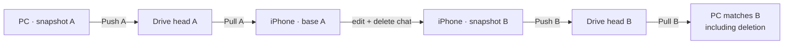
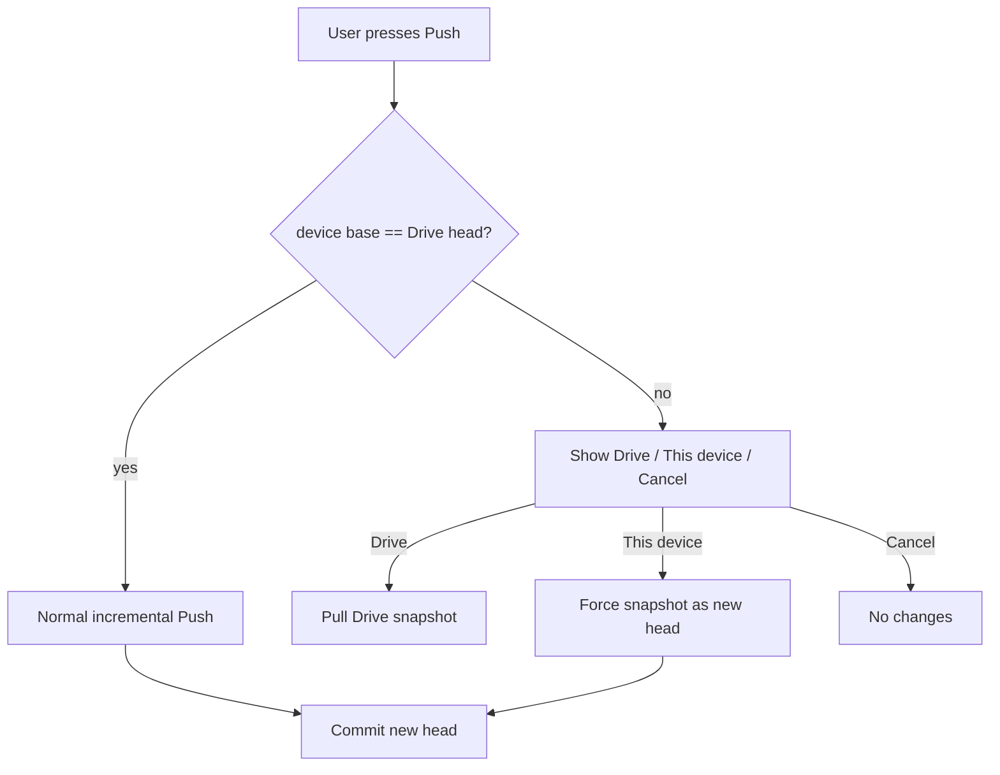
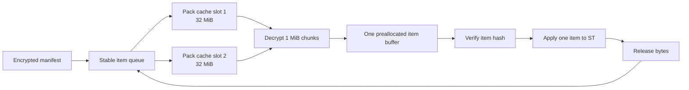

# Drive v2 Latest-Snapshot Sync Design

**Status:** Owner approved on 2026-08-09
**Scope:** Drive v2 Pull, incremental Push, deletion propagation, and explicit source selection

## 1. User Model

Every successful Push publishes a complete encrypted snapshot. The latest
committed snapshot is the Drive source of truth until another device Pushes.
The account owner chooses which side wins when a device is behind.



There is no automatic merge and no device-clock-based winner.

## 2. Head and Device Base

- Each committed manifest has a `commitId` and parent commit IDs.
- The unreferenced commit is the current Drive `head`.
- The existing schema-2 commit created by Phase 1 has no parent and is treated
  as the genesis head; no reset or re-upload is required after upgrading.
- New commit files expose only `ts=commit-v2` and parent ciphertext hashes in
  `appProperties`. Device name, counts, base, and force metadata stay inside
  the encrypted manifest.
- Each device stores `baseCommitId`, updated only after a successful Pull or
  Push.
- A normal Push is direct when `baseCommitId === head.commitId`.
- A different base means the device is stale or the history diverged. The
  user chooses the source of truth.
- Concurrent children of the same parent may create multiple heads. The same
  chooser resolves them; a chosen local Push references all current heads so
  the history returns to one head.

## 3. One Decision Dialog

When the device base differs from Drive, show one dialog with:

- Drive device name, server-created commit time, item count;
- this device name and item count;
- counts that will be added, replaced, and deleted for each direction.

Actions:

1. **Use Drive snapshot** — Pull Drive onto this device.
2. **Make this device latest** — publish this device as the new Drive head.
3. **Cancel** — change nothing.

There is no safe default, nested confirmation, or silent merge. The dialog
states that deletions are included. The account owner makes the decision.
If concurrent activity creates multiple Drive heads, each decrypted Drive
snapshot appears as a separate choice beside **This device** and **Cancel**.



## 4. Snapshot and Deletion Semantics

- A manifest is a complete snapshot for every enabled sync scope.
- Choosing Drive makes local enabled scopes match Drive exactly.
- Choosing this device makes Drive match the completed local scan exactly.
- An item absent from the chosen snapshot is deleted on the other side.
- Disabled scopes are outside the snapshot and are never deleted.
- A scan must report complete before absence can become deletion. A failed or
  cancelled scan cannot Push or delete anything.
- Pull shows add/replace/delete counts before applying.
- Additions and replacements finish first. Deletions run serially last, only
  after all required pack bytes verify and every prior apply succeeds.
- `baseCommitId` changes only after the complete apply and deletion phase.

## 5. Bounded-Memory Pull

Pull never loads all packs or all items together.

1. List committed manifests and resolve the selected head.
2. Download and decrypt the small manifest.
3. Scan the local device and build the preview.
4. For each remote item in stable apply order:
   - fetch referenced packs through an LRU cache of at most two 32 MiB packs;
   - bounds-check offset and boxed length;
   - decrypt one 1 MiB chunk at a time;
   - verify each chunk hash;
   - copy plaintext into one preallocated item buffer;
   - verify the complete item hash;
   - apply that item serially through the existing ST adapter;
   - release the item buffer before continuing.
5. Apply confirmed deletions serially.
6. Save `baseCommitId` and report completion.

The downloader may prefetch one next pack while the current item applies, but
the byte budget remains two packs plus one reconstructed item. No
`Array.from(Uint8Array)` conversion is allowed.



## 6. Incremental Push and Pack Reuse

- Push still scans a complete snapshot and builds deterministic pack names.
- Existing packs with the same name and size are reused.
- Changed pack groups upload with four bounded workers and resumable retry.
- The new encrypted manifest is committed only after all referenced packs
  verify.
- Normal Push uses the current head as parent.
- **Make this device latest** uses every current head as parent and records the
  device's prior base in the encrypted manifest for diagnosis.
- The new commit becomes visible only after pack verification; a failed Push
  leaves the previous head usable.

## 7. Failure and Resume

- Network, 408, 429, and 5xx use the existing resumable retry behavior.
- 401 pauses for Connect & Resume.
- Pull records selected commit and completed item IDs in the crash journal.
- A retry rescans local state, skips items already matching the selected
  snapshot, and continues.
- If any download, decrypt, hash, or apply fails, no deletions run and the
  device base does not advance.
- A Push failure never publishes a partial manifest.

## 8. UI and Progress

Drive v2 exposes Push, Pull, and Check Status.

Example progress:

```text
Reading snapshot…
Downloading packs 8/30 · 11.2 MB/s · ETA 00:19
Applying 724/2347 · Chats
Deleting 3 items
Pull complete · 112s
```

Check Status shows Drive head device/time, this device base, and whether the
device is current, ahead locally, or stale.

## 9. Retention and Cleanup Boundary

- The active head is never deleted during Push or Pull.
- Old commits and unreferenced packs remain recoverable until a separate,
  explicit cleanup feature is approved.
- This phase does not silently empty Drive Trash or permanently delete roots.

## 10. Verification Gates

Automated:

- head/base and multi-head choice tests;
- Drive / this device / cancel dialog tests;
- full-snapshot deletion and disabled-scope tests;
- incomplete scan cannot delete or commit;
- manifest/chunk/item authentication failure tests;
- two-pack LRU byte-budget tests;
- serial apply and deletion-last tests;
- interrupted Pull resume tests;
- incremental pack reuse and atomic commit tests;
- legacy HTTP/OG behavior remains unchanged;
- full Vitest, TypeScript, production build, and diff checks.

Live:

- PC Push → empty iPhone Pull → compare 2,347 items;
- edit and delete on iPhone → Push → PC chooser → use Drive → verify exact
  additions, replacements, and deletions;
- stale PC Push → choose this device → verify PC becomes head;
- capture iPhone native log and prove no Jetsam/WebContent termination;
- Gate 1: full iPhone Pull completes in 15 minutes or less;
- competitive target: no more than 2× OG on the same bytes and network.

## 11. Non-Goals

- automatic per-item merge;
- multiple-account collaboration;
- background or simultaneous auto-sync;
- permanent Root deletion or pack garbage collection;
- selecting a winner without explicit owner input when bases differ.
