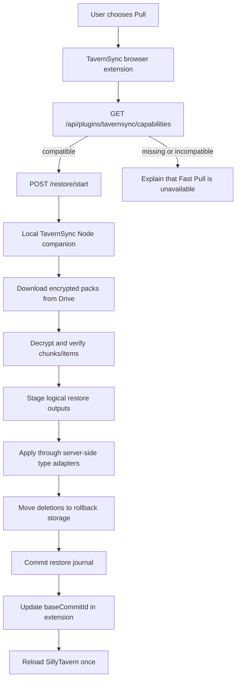
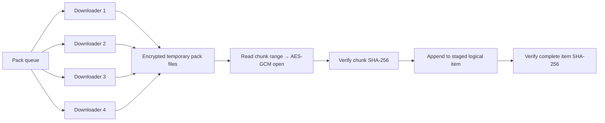

# Drive v2 Node-Side Bulk Logical Restore Design

**Status:** Owner approved direction; written design awaiting owner review

**Date:** 2026-08-09

**Scope:** Google Drive v2 fast Pull through a TavernSync companion server plugin

## 1. Decision

Drive v2 Pull will restore the existing **logical TavernSync snapshot** inside
the local SillyTavern Node process. It will not treat the snapshot as a raw copy
of the SillyTavern user directory.

This distinction is required because the current encoder stores different item
representations:

- characters are PNG bytes;
- chats and group chats are canonical JSONL;
- settings are a filtered canonical JSON object;
- personas combine metadata and an optional base64 avatar;
- presets, lorebooks, groups, themes, and quick replies are canonical JSON.

The companion plugin must therefore provide one restore adapter per logical
item type. Each adapter must produce the same observable SillyTavern state as
the existing browser-side `applyLocalItem` path, while avoiding one browser-to-
Node HTTP request per item.

No generative AI or paid model API participates in Push or Pull.

## 2. Goals

1. Remove the thousands of browser-to-Node round trips in Drive v2 Pull.
2. Keep Google Drive contents encrypted and opaque.
3. Keep the Drive access token and restore key material in memory only.
4. Bound WebView and Node memory independently of total snapshot size.
5. Validate every downloaded chunk and reconstructed item before live data is
   changed.
6. Propagate deletions only after every required remote item is verified and
   staged.
7. Recover safely after cancellation, network failure, Node restart, or an
   apply failure.
8. Preserve the latest-snapshot and `baseCommitId` rules already approved for
   Drive v2.
9. Work as a companion plugin without modifying SillyTavern core.

## 3. Non-Goals

- raw byte-for-byte backup of the complete SillyTavern user directory;
- syncing caches, secrets, logs, device-specific state, or excluded settings;
- changing the Drive v2 pack or manifest format;
- changing the HTTP/OG backend;
- persisting Google tokens, passphrases, root keys, or restore subkeys;
- silently using the legacy slow Pull when the companion plugin is absent;
- permanent deletion of rollback data before a restore commits successfully.

## 4. Architecture



The extension remains responsible for user interaction, selecting the Drive
head, obtaining a Google access token from a user gesture, deriving the Drive
v2 keys, and updating client-side sync state after success.

The companion plugin is responsible for Drive download, decryption, validation,
staging, server-side application, deletion, rollback, and progress reporting.

## 5. Packaging Boundary

The companion lives in the TavernSync repository as a separately packaged
server plugin and is installed under:

```text
SillyTavern/plugins/tavernsync-companion/
```

It exports the standard SillyTavern server-plugin `info`, `init`, and optional
`exit` functions. Its routes are mounted under:

```text
/api/plugins/tavernsync/
```

Desktop installation may copy or install this package into `plugins/`.
SillyiOS packaging remains an integration boundary: its owner must confirm
whether the plugin can be bundled, installed, and retained across app updates.
The restore protocol must not depend on a native iOS-only bridge.

## 6. Capability Handshake

`GET /api/plugins/tavernsync/capabilities` returns only non-sensitive metadata:

```json
{
  "protocol": 1,
  "pluginVersion": "0.1.0",
  "drivePackSchemas": [2],
  "itemTypes": [
    "settings", "preset", "worldinfo", "persona", "character",
    "chat", "group", "groupchat", "quickreply", "theme"
  ],
  "supportsRollback": true,
  "supportsCancellation": true
}
```

The extension enables Fast Pull only when protocol, schema, and required item
types match. Missing or incompatible plugins produce an explicit choice:

- cancel and install/update the companion; or
- deliberately use Legacy Pull with its expected performance warning.

There is no silent fallback that can unexpectedly begin a 90-minute transfer.

## 7. Restore Start Contract

`POST /api/plugins/tavernsync/restore/start` is authenticated through the normal
SillyTavern session and CSRF protections. It accepts:

- a client-generated restore request ID;
- selected Drive root, packs-folder, and commit identifiers;
- the already decrypted Drive v2 manifest;
- enabled sync scopes;
- the current device/base commit identifiers;
- a short-lived Google `drive.file` access token;
- the minimum exported v2 chunk-decryption key material;
- expected total item, plaintext-byte, and pack counts.

The passphrase, Drive root key, manifest key, and pack-name key are not sent to
the plugin. The plugin receives only the subkey needed to decrypt chunk frames.

The plugin validates the manifest independently even though the extension has
already validated it. It rejects unsupported schemas, unknown item types,
duplicate IDs, invalid pack ranges, unsafe logical IDs, count mismatches, and
requests for a different authenticated SillyTavern user.

Only one restore per SillyTavern user may run at a time.

## 8. Transport Security and Secret Lifetime

Fast Pull is allowed only when either:

1. the browser-to-Node connection is loopback; or
2. the SillyTavern origin is authenticated HTTPS.

An unencrypted non-loopback HTTP origin must refuse Fast Pull because the Drive
token and restore subkey would traverse the network in plaintext.

The plugin must:

- never log the request body, token, or key material;
- never persist them in the job journal, temporary files, or error reports;
- retain them only for the active job;
- overwrite key `Buffer` contents on completion where practical;
- drop all token references on completion or failure;
- treat JavaScript string zeroization as best-effort, not a guarantee;
- use the token only with Google Drive API hosts and never follow a credentialed
  redirect to an untrusted host.

## 9. Download and Bounded-Memory Reconstruction

The plugin lists the selected packs folder once and maps encrypted pack names to
Drive file IDs. It downloads immutable packs with bounded concurrency and retry
for network loss, `408`, `429`, and `5xx` responses.



Encrypted packs are written to temporary files rather than retained in WebView
memory. Decryption reads only the referenced chunk range. Reconstructed items
are streamed to staged files, so a large chat does not require a second full
in-memory copy.

Baseline download concurrency is four packs. The implementation must expose
measured peak in-flight bytes and allow lowering concurrency for constrained
NodeMobile builds without changing the protocol.

## 10. Logical Type Adapters

Each adapter has one responsibility: validate one logical item and create a
staged representation that matches SillyTavern's on-disk/user-state format.

Required adapters:

| Logical type | Input representation | Required restore behavior |
|---|---|---|
| `character` | PNG bytes | Validate PNG/card metadata and preserve the snapshot avatar name |
| `chat` | canonical JSONL | Validate every JSONL record and stage the character chat file |
| `groupchat` | canonical JSONL | Validate records and stage the group-chat file |
| `group` | canonical JSON | Validate group ID and stage group metadata |
| `worldinfo` | canonical JSON | Validate logical name and stage the lorebook format used by ST |
| `preset` | canonical JSON | Validate API source/name and stage the matching preset file |
| `settings` | filtered canonical JSON | Merge only synchronized fields into current settings; preserve excluded/device-specific fields |
| `persona` | metadata + optional base64 image | Validate avatar ID, stage image, and merge persona metadata into settings |
| `theme` | canonical JSON | Stage the theme entry without overwriting unrelated themes |
| `quickreply` | canonical JSON | Stage the quick-reply set without overwriting unrelated sets |

Adapter output must be compared against the existing browser-side apply path in
golden equivalence tests. A type is not advertised in capabilities until its
adapter passes those tests.

Character payloads must start with a supported PNG signature. The scanner's
rare JSON fallback is not safe to feed to the existing PNG importer; a snapshot
containing that fallback is rejected during Prepare with the item ID and no live
mutation. The source device must regain avatar access and create a new snapshot.

The legacy browser path currently skips theme and quick-reply application, so
those two adapters use round-trip rescan equality against their canonical
scanner representations rather than treating the legacy skip as correct.

## 11. Staging, Apply, and Rollback

The restore uses three phases:

### Phase A — Prepare

1. Download all referenced packs.
2. Authenticate every AES-GCM chunk.
3. Verify chunk and complete-item SHA-256 hashes.
4. Run every type adapter into a job-specific staging directory.
5. Build the complete target/deletion plan.

No live SillyTavern data is changed in this phase.

### Phase B — Apply

1. Acquire a per-user restore lock.
2. Recheck selected commit and job invariants.
3. For each changed live target, move the old target to a rollback directory.
4. Atomically rename the staged target into place where the platform permits.
5. Merge compound targets such as settings through their adapter transaction.
6. Record each completed operation in a non-secret journal.

### Phase C — Delete and Commit

1. Move items absent from the selected complete snapshot to rollback storage.
2. Verify the resulting logical item set and hashes.
3. Mark the restore journal committed.
4. Return the selected commit ID and metrics to the extension.
5. The extension updates `baseCommitId` and reloads SillyTavern once.

Deletion never begins if a required remote item is missing, unauthenticated, or
failed to stage.

If apply fails, the plugin reverses completed journal operations. Originals are
moved rather than copied where possible, limiting additional disk usage.

## 12. Cancellation, Failure, and Restart

Endpoints:

```text
GET  /restore/:jobId
POST /restore/:jobId/cancel
```

Cancellation stops new downloads, settles active work, removes uncommitted
staging data, and leaves the live snapshot unchanged during Prepare. During
Apply it triggers rollback.

On plugin startup, incomplete journals are inspected before new restores are
accepted:

- Prepare-only jobs are discarded because no live data changed.
- Apply jobs are rolled back to the pre-restore state.
- Committed jobs may have stale temporary/rollback directories cleaned safely.

Google `401` pauses/fails the job without opening OAuth from Node. The user must
press Connect Google again in the extension and start/resume with a fresh token.
No job can publish a successful `baseCommitId` after failure or cancellation.

## 13. Progress and Metrics

The status endpoint reports:

```text
Downloading packs 8/30 · 41.2 MB/s · ETA 00:19
Verifying items 1,204/2,347
Staging chats 502/711
Applying 1,900/2,347
Deleting 31 stale items
Committing restore
```

Metrics include:

- selected commit and item/pack counts;
- encrypted and plaintext bytes;
- download, decrypt/verify, staging, apply, deletion, and total times;
- average Drive throughput and retry count;
- peak Node heap/RSS and temporary disk use;
- number of added, replaced, deleted, skipped, and rolled-back items.

Metrics and errors contain logical item IDs only when needed for diagnosis and
never contain decrypted content, tokens, or key material.

## 14. Latest-Snapshot Semantics

Pull always means "use the selected Drive snapshot". It does not ask whether
the current phone data should become latest.

The choice between Drive and local data appears only when a stale device tries
to Push over a newer Drive head. Existing guarded latest-push-wins behavior
remains unchanged.

After a successful restore, the extension records the selected commit as the
device base. A failed, cancelled, or rolled-back restore does not advance it.

## 15. Compatibility and Fallback

- HTTP/OG synchronization is unchanged.
- Existing Drive v2 snapshots and the measured 30-pack snapshot remain valid.
- The pack/manifest schema stays at v2.
- Fast Pull requires a compatible companion plugin.
- Legacy Pull remains available only through an explicit warning/confirmation.
- Companion absence must not hide Push or corrupt Drive state.

## 16. Test Strategy

### Unit tests

- manifest, logical-ID, pack-range, path, and count validation;
- Drive URL/redirect allow-list behavior;
- token/key non-persistence and error redaction;
- chunk AES-GCM authentication and SHA-256 mismatch rejection;
- one adapter test suite for every advertised item type;
- settings/persona merge preservation of excluded local fields;
- deletion-last and no-delete-on-prepare-failure;
- cancellation in Prepare and rollback during Apply;
- journal recovery after simulated process termination;
- per-user restore lock and protocol-version rejection.

### Golden equivalence tests

For each item type, apply the same logical fixture through:

1. the existing browser/API path; and
2. the companion adapter into an isolated user directory.

Rescan both results and require equal TavernSync logical IDs and hashes.

### Integration tests

- mock Google Drive serving encrypted v2 manifest and packs;
- restore into an isolated SillyTavern user directory;
- rescan and compare every item hash with the selected manifest;
- inject network loss, `429`, corrupt chunks, missing packs, cancellation, and
  process restart;
- confirm no live change before Prepare completes and correct rollback after an
  Apply fault.

### Live benchmarks

1. Restore the current 2,347-item / 30-pack snapshot into an isolated PC user.
2. Verify exact logical manifest equality and representative UI behavior.
3. Record stage timings, memory, disk, retries, and wall-clock duration.
4. After SillyiOS packaging is available, repeat on iPhone with native syslog.

Initial gates:

- PC full restore: **5 minutes or less**;
- iPhone full restore: **15 minutes or less**, no Jetsam;
- target after tuning: within 2× the measured 93-second clean Push where device
  storage permits;
- zero missing/extra logical items in enabled scopes;
- no unexplained hash mismatch, silent skip, or premature deletion.

## 17. Delivery Sequence

1. Implement protocol/types and a mock companion harness.
2. Implement plugin capability/security/job lifecycle.
3. Implement Drive download and bounded reconstruction.
4. Implement adapters and golden equivalence tests by item type.
5. Implement staging, rollback, deletion, and journal recovery.
6. Integrate extension detection, start/status/cancel, and progress UI.
7. Run isolated PC restore and benchmark.
8. Package the companion for desktop installation.
9. Adapt packaging only after the SillyiOS owner confirms its plugin boundary.
10. Run live iPhone restore with native log capture before making Fast Pull the
    default on SillyiOS.

## 18. Acceptance Criteria

The design is complete only when:

- every advertised logical type has a golden-equivalent server adapter;
- existing Drive v2 snapshots restore without repacking;
- token/key material is not persisted or logged;
- full validation precedes live mutation;
- deletion is last and rollback is verified;
- failed restores do not advance device base state;
- HTTP/OG behavior and existing Push behavior remain unchanged;
- PC benchmark and manifest equality gates pass;
- iOS support is reported as unverified until the companion is bundled and the
  real-device test passes.
