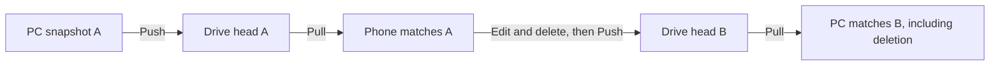

# Drive v2 Extension-Only Adaptive Restore Design

**Status:** Owner-approved design; pending written-spec review

**Supersedes for Drive v2 Pull:** Core Restore, Companion Restore, and the serial/fixed-batch Pull path

**Does not replace:** Drive v2 encrypted-pack Push, HTTP/OG sync, or existing maintenance controls

## 1. Goal and User Contract

TavernSync must provide fast Google Drive Push and Pull to nontechnical users
without requiring them to understand Git, terminals, server plugins, Core
patches, configuration files, or special SillyiOS builds.

The entire user installation contract is:

1. Install or update the TavernSync extension.
2. Refresh SillyTavern.
3. Connect Google Drive.
4. Enter the same TavernSync Encryption passphrase used on the other device.
5. Press Push or Pull.

The Encryption passphrase is the only encryption secret the user creates and
remembers. Google OAuth authorizes access to Drive; it is not an encryption
key. A forgotten passphrase cannot be recovered. Encrypted packs without their
passphrase remain unreadable data in Drive until the account owner deletes
them.

## 2. Source-of-Truth Semantics

Every successful Push publishes one complete encrypted snapshot for the
enabled scopes. The newest committed Drive snapshot is the source of truth.

- PC and mobile devices may both Push.
- Pull always restores the newest committed Drive snapshot. It never asks
  whether local data should win, and it performs no content merge.
- If a device tries to Push while Drive contains a newer snapshot than that
  device's base, TavernSync shows one decision dialog:
  - **Use Drive snapshot** — Pull the current Drive snapshot.
  - **Make this device latest** — Push this device as the newest snapshot.
  - **Cancel** — do nothing.
- Drive server time determines commit order; device clocks do not.
- A deterministic file-ID tie-breaker resolves equal server timestamps.
- Deletions are part of the complete snapshot. Pull makes enabled local scopes
  match the Drive snapshot, including deleting items absent from it.
- Disabled scopes are never written or deleted.



## 3. Distribution Boundary

Drive v2 Fast Pull runs entirely inside the TavernSync browser extension and
uses only SillyTavern APIs already available to ordinary extensions.

It must not require or silently install:

- a SillyTavern Core patch;
- a server plugin or Companion;
- `enableServerPlugins`;
- terminal commands;
- Git operations;
- an app-specific IPA;
- native addons, WASM, or child processes.

The same TavernSync extension must work on desktop SillyTavern, Android-hosted
SillyTavern, SillyiOS, and browsers connected to a remote SillyTavern backend.

### 3.1 Automatic Google Drive Storage Resolution

Storage schema versions, Drive Root IDs, packs, blobs, and manifests are
implementation details. Public UI, normal status messages, and recovery copy
must not require users to recognize or choose any of them.

The extension resolves Google Drive storage as follows:

1. Connect Google and list every app-created current-format TavernSync storage
   candidate. A remembered Drive folder ID is a cache hint, not authority.
2. If a remembered candidate still exists and its remembered key opens its
   newest authenticated manifest, keep it without additional discovery work.
3. Otherwise, after the user supplies the Encryption passphrase, derive the
   candidate-specific key from that passphrase and candidate Root ID, then try
   to authenticate the candidate's newest encrypted manifest.
4. If exactly one candidate authenticates, select it and remember its Root ID.
   If multiple candidates authenticate with the same passphrase, select the
   candidate containing the newest committed snapshot by Drive server time and
   deterministic file-ID tie-breaker.
5. If candidates contain committed snapshots but none authenticate, report
   `Encryption passphrase is incorrect` and perform no local or remote write.
6. Pull never creates storage. With no current-format storage, it reports that
   no backup exists.
7. Push may create one current-format storage area only after the user presses
   Push and no current-format candidates exist. Discovery, Connect, Unlock,
   Check Status, and Pull must never create storage silently.
8. An explicitly remembered empty storage area may be reused. Ambiguous empty
   candidates require an Advanced recovery action; they must not be selected by
   guessing.

The internal current-format marker is used only to enumerate candidates. The
extension must not publish a stable plaintext tag derived from the Encryption
passphrase. The passphrase proves access by authenticating ciphertext; it is
not exposed as a Drive search address.

Legacy storage is never selected or created by the public path. Legacy support
may remain internally for cleanup or controlled development migration, but no
public control asks users to choose a schema version.

## 4. Extension-Only Pull Architecture

The existing pack format remains unchanged: logical SillyTavern items are
split into authenticated chunks, encrypted with the user's passphrase-derived
key, and grouped into Drive packfiles. No re-Push or Drive Root reset is
required for this Pull engine.


The pipeline has no four-item batch barrier. When one writer finishes, the
next ready item starts immediately while other items continue downloading,
decrypting, or writing.

### 4.1 Snapshot Resolution

1. List committed encrypted manifests.
2. Select the newest committed manifest by Drive server time and deterministic
   tie-breaker.
3. Decrypt the manifest with the current Encryption passphrase.
4. Reject a wrong passphrase or unauthenticated manifest before any local
   write.
5. Filter manifest items by enabled scopes.

Pull does not run the existing full local content scan, calculate local hashes,
or open a local/Drive chooser.

### 4.2 Streaming Reader

- Range-download only the pack regions needed by queued items.
- Decrypt and authenticate one chunk at a time with Web Crypto.
- Verify every chunk and complete item hash automatically; this is an internal
  integrity check, not another user decision.
- Never convert large `Uint8Array` values to JavaScript number arrays.
- Never hold the complete snapshot or all 32 MiB packs in memory.
- Keep at most 64 MiB of encrypted prefetch data and 48 MiB of reconstructed
  plaintext in flight. Large items consume the shared budget rather than
  bypassing it.

### 4.3 Cost-Aware Rolling Writers

Items enter separate queues so one expensive chat or PNG cannot stop unrelated
small JSON items.

| Class | Initial concurrency | Allowed range | Examples |
| --- | ---: | ---: | --- |
| Small | 8 | 4-16 | presets, lorebooks, groups, quick replies, themes |
| Medium | 4 | 2-8 | ordinary chats and character cards |
| Heavy | 1 | 1-2 | large chats, large PNGs, persona images |
| Serial | 1 | 1 | settings and shared metadata mutations |

These are controller bounds, not a promise that exactly that many requests run
at all times. Dependencies take priority: a character must exist before its
chats are restored, and shared settings mutations remain serial.

Every 16 completed writes, the controller evaluates completion latency,
failures, and byte-budget pressure:

- increase one slot when the queue is waiting, latency is stable, and byte
  budgets have headroom;
- decrease immediately after transient network errors, repeated server
  failures, or a doubled rolling p95 latency;
- pause new heavy work while a heavy item already owns most of the plaintext
  budget;
- never rely on `performance.memory`, which is unavailable on many iOS
  WebViews.

This controller optimizes sustained throughput instead of producing visible
bursts of four items followed by several idle seconds.

## 5. Local Inventory and Deletions

Exact snapshot restore still requires knowing which local IDs should be
deleted, but it does not require reading and hashing every local file.

- Build a lightweight ID/name inventory through existing list endpoints for
  enabled scopes only.
- Do not load chat bodies, character PNG bytes, or other full payloads merely
  to calculate deletions.
- Calculate deletion candidates from `local inventory - remote manifest`.
- Apply additions and replacements first.
- Run deletions serially only after every remote item has downloaded,
  decrypted, verified, and written successfully.
- If Pull fails or is cancelled, no deletion runs and the device base does not
  advance.

Settings keep the existing merge rule so device-local secrets and settings
excluded from TavernSync scope are not erased by another device.

## 6. Checkpoint, Resume, and Failure Semantics

Extension-only restore cannot provide filesystem transaction rollback. It
therefore uses resumable, idempotent writes plus deletion-last rather than
claiming an all-or-nothing rollback it cannot implement.

- Persist the selected commit ID and completed item IDs in TavernSync's saved
  extension settings every 25 completions or two seconds, whichever comes
  first, and immediately on error/cancel.
- A retry against the same Drive head skips completed IDs and resumes the
  rolling queues.
- If Drive head changed, discard the old checkpoint and start the newest
  snapshot.
- Reapplying an already written item is safe and must produce the same result.
- Advance `baseCommitId` only after writes and deletions complete.
- Reload SillyTavern once after successful completion.

Errors:

- network loss, 408, 429, and 5xx: bounded retry with exponential backoff;
- 401: pause and ask the user to reconnect Google, then resume;
- wrong passphrase, authentication failure, hash mismatch, or malformed item:
  stop before that item is written, preserve the checkpoint, and run no
  deletions;
- Cancel: stop assigning new work, settle active requests, save the checkpoint,
  and run no deletions.

## 7. Existing Capability Compatibility

Making the default flow simple must not remove advanced, maintenance, or
recovery controls. Preserve the current controls and their safety boundaries:

- Push, Pull, and Check Status;
- enabled sync scopes;
- Pull on startup and Push on chat close;
- deletion propagation;
- Connect and Disconnect Google;
- Unlock, remember-device behavior, and change passphrase;
- Rescan this device and View Log;
- Reset sync on this device;
- Wipe remote sync data;
- Clean up old Drive data;
- Start fresh Google Drive storage;
- Resume Push.

The basic section shows only the normal path:

```text
Connect Google
Encryption passphrase
Push
Pull
```

Other controls remain available under a collapsed **Advanced** section.
Collapsing a control is allowed; deleting it or making it unreachable is not.

Maintenance actions remain distinct:

- **Clean up old data** removes eligible unreferenced old Drive data after
  confirmation and must never delete the active head.
- **Wipe remote sync data** clears remote sync state, never local SillyTavern
  files.
- **Start fresh Google Drive storage** moves the current storage area to Drive
  Trash and creates an empty current-format storage area. It does not
  permanently empty Drive Trash or delete local SillyTavern data. The existing
  internal DOM ID may remain for compatibility, but user-facing copy must not
  mention Root or a schema version.

HTTP/OG behavior and controls remain unchanged.

## 8. Progress and Diagnostics

Progress must expose continuous throughput rather than only batch numbers:

```text
Reading latest snapshot…
Downloading 412/2347 · 18.2 MB/s
Restoring 724/2347 · 14.6 items/s · 12 writers · ETA 01:51
Deleting 3 obsolete items
Pull complete · 154s
```

Normal user-facing status describes backups and item counts, never pack/blob
counts or schema versions. For example:

```text
Connected to Google Drive
Backup ready · 2,347 items
No backup yet · Push this device to create one
```

The diagnostic log records commit ID, item type, item size, queue class,
download/decrypt/write durations, retries, active writer counts, in-flight byte
budgets, checkpoint saves, and the final phase. It never logs the passphrase,
derived key, Google token, or decrypted item contents.

## 9. Performance Gates

Measure end-to-end time from pressing Pull through the final successful reload,
including manifest resolution, download, decrypt, write, deletion, and
checkpoint overhead.

- Required correctness gate: 2,347-item snapshot restores with matching enabled
  inventory and no missing or extra items.
- Required iPhone stability gate: no Jetsam, WebContent termination, or
  self-reload before TavernSync completion.
- First performance gate: complete in 5 minutes or less on the current test
  snapshot and network.
- Competitive target: no more than 2x the equivalent OG restore on the same
  bytes, device, and network.
- Stretch target: approach 2 minutes without exceeding byte budgets or causing
  instability.

The design does not promise the 93-second Push time because Extension-only
Pull still uses existing per-item SillyTavern write endpoints.

## 10. Verification

Automated coverage must include:

- newest committed snapshot selection and deterministic ties;
- current-format candidate enumeration without legacy fallback;
- remembered Root reuse only while it remains valid;
- passphrase-authenticated selection across one or multiple candidates;
- no storage creation during Connect, Unlock, Pull, or Check Status;
- first Push creates storage only when no current-format candidate exists;
- public UI and errors contain no schema, Root, pack, blob, or manifest jargon;
- Pull never invokes full local content scan, content diff, merge, or source
  chooser;
- stale Push shows Drive/local/cancel and honors the selected source;
- wrong passphrase fails before writes;
- chunk, item, and manifest authentication failures;
- rolling scheduling has no fixed batch barrier;
- adaptive increase/decrease behavior and hard concurrency bounds;
- encrypted/plaintext in-flight byte budgets;
- dependency ordering and serial settings writes;
- lightweight inventory and disabled-scope protection;
- write-first/deletion-last behavior;
- cancellation, network retry, 401 reconnect, and checkpoint resume;
- base advances only after full completion;
- every existing UI control remains present and bound;
- HTTP/OG regression coverage;
- TypeScript, Vitest, production build, and diff checks.

Live verification must run on a disposable local profile first, on a separate
port from the owner's primary SillyTavern. It must never switch the primary
port to a test Data Root. After desktop verification, test the same extension
on the current SillyiOS build while capturing native syslog.

## 11. Non-Goals

- SillyTavern Core changes;
- Companion or server-plugin distribution;
- automatic per-item conflict merge;
- multiple-user collaboration;
- permanent Drive Trash deletion;
- replacing the existing encrypted-pack Push format;
- modifying HTTP/OG sync behavior;
- claiming transactional rollback from browser-only APIs.
